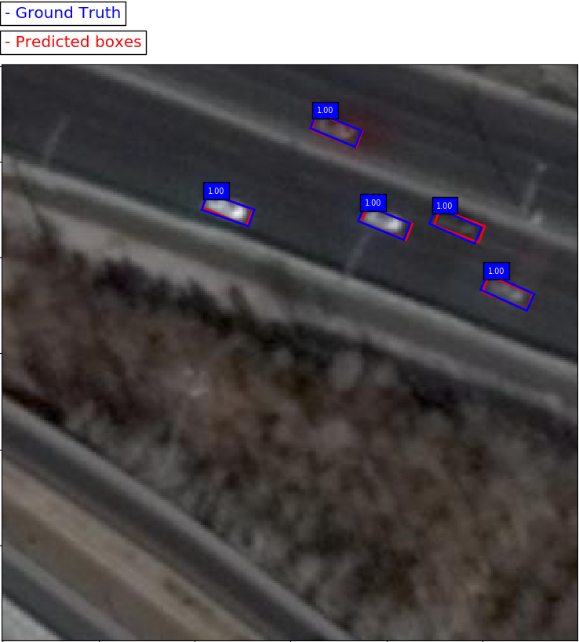
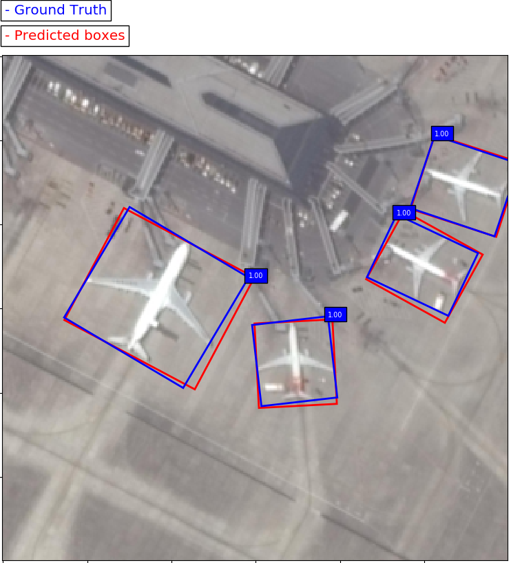
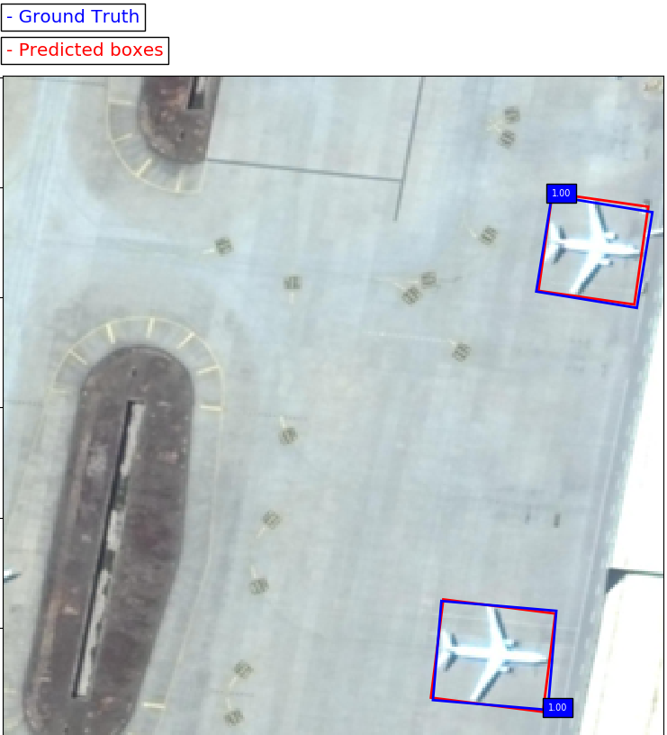
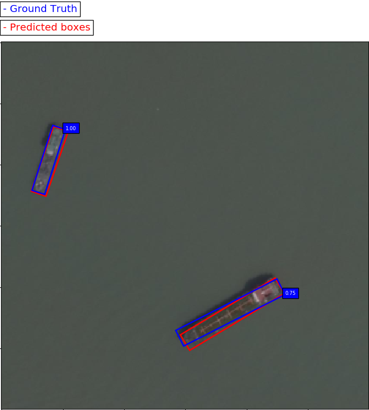
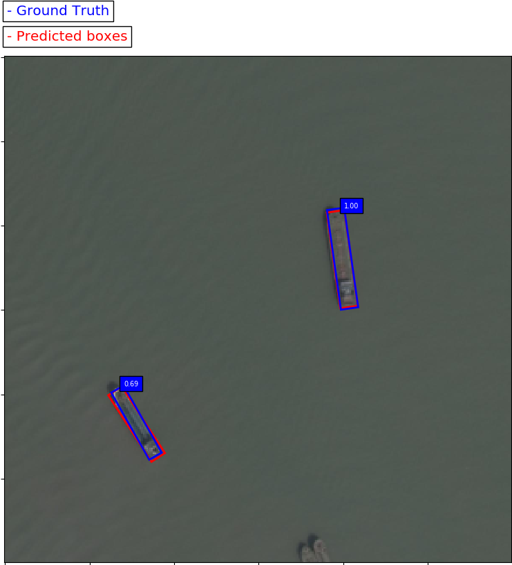

# DRBox : Detector of rotatable bounding boxes implementation in Keras

## Overview

This projects aims to reproduce the DRBox model architecture introduced in the paper 
[Learning a Rotation Invariant Detector with Rotatable Bounding Box](https://arxiv.org/abs/1711.09405) 
using Keras and Tensorflow as a backend. The original implementation of DRBox using Caffe by Lei Liu can be found 
[here](https://github.com/liulei01/DRBox).

DRBox is used for detection tasks where the objects are orientated arbitrarily. This code show examples that DRBox is 
used to detect vehicles, ships and airplanes in remote sensing images, but can also be used for other tasks.

DRBox is a model inspired by the architecture of SSD : [Single Shot MultiBox Detector](https://arxiv.org/abs/1512.02325).
This project started from the implementation of the SSD model in keras by pierluigiferrari : 
[SSD: Single-Shot MultiBox Detector implementation in Keras](https://github.com/pierluigiferrari/ssd_keras)

The main goal of this project is to create a DRBox implementation that is well documented for those who are interested 
in a low-level understanding of the model. The provided documentation and detailed comments hopefully make 
it a bit easier to dig into the code and adapt or build upon the model.

## Performance

Here are the Average Precision (AP) evaluation results of the original implementation and the evaluation results of a model 
trained using this implementation. "In all cases the results match those of the original Caffe models." 


<table width="70%">
  <tr>
    <td></td>
    <td colspan=3 align=center>Original DRBox</td>
    <td colspan=3 align=center>Keras DRBox</td>
  </tr>
  <tr>
    <td></td>
    <td>Ship</td>
    <td>Vehicle</td>
    <td>Airplane</td>
    <td>Ship</td>
    <td>Vehicle</td>
    <td>Airplane</td>
  </tr>
  <tr>
    <td>AP 0.5</td>
    <td>94.06</td>
    <td>89.07</td>
    <td>99.28</td>
    <td>80.0</td>
    <td>76.2</td>
    <td>98.9</td>
  </tr>
  <tr>
    <td>mAP 0.5</td>
    <td colspan=3 align=center>94.13</td>
    <td colspan=3 align=center>85.0</td>
  </tr>
    <tr>
    <td>AP 0.1</td>
    <td colspan=3 align=center></td>
    <td>91.0</td>
    <td>85.3</td>
    <td>99.0</td>
  </tr>
  <tr>
    <td>mAP 0.1</td>
    <td colspan=3 align=center></td>
    <td colspan=3 align=center>91.7</td>
  </tr>
</table>

## Result Analysis

This model can achieve pretty good performance on the three different datasets. 
However, it cannot achieve State of the Art performance.
There is a lack of precision in the localisation of object, thus the mAP 0.1 is 6% above the mAP 0.5.

This can be explained by several things :
* Pyramid input strategy is not implemented
* Hyper-parameters tuning could be improved


## Examples
Below are some prediction examples of the fully trained Keras DRBox model.


 


 


 


### Dependencies

* Python 3
* Numpy 
* Keras
* Tensorflow
* PIL
* Open-CV

The Theano and CNTK backends are currently not supported.

In order to use docker, you need :

* docker
* docker-compose (at least 1.19 for GPU support)
* nvidia-docker2 (if you want to use a GPU)


## Dataset

The original dataset can be found here : https://pan.baidu.com/s/1sliHG09
To extract the files, you can use the following commands :
```
cat data.tar.gz*>data.tar.gz
tar -zxvf data.tar.gz
```

You will need to place the data in the data folder and run the following command to create the csv file containing the 
values for the bounding boxes of the specified objects :

```
python create_dataset.py -d data/Airplane/train_data/ -v 0.1 -t 0.1 -s -f data/Airplane -o a
```

## How to use it

DRBox is now designed as a single task network only. So you should train it for each type of objects separately. 
If you want to train an airplane detection network, you should create the csv files containing the data of the bounding 
boxes of the airplanes images, then you can start training by running :

```
python Training_DRBox.py
```
The trained models will be stored in the "trained_models" folder.

To make predictions using a trained model, named "plane.h5", on the test set, run :

```
python predict_DRBox.py -i data/Airplane/train_data/ -m trained_models/plane.h5 -l data/Airplane/labelstest.csv
```

To evaluate a trained model, named "plane.h5", on the 600 images of the test set, run :
```
python evaluation_DRBox.py -i data/Airplane/train_data/ -m trained_models/plane.h5 -l data/Airplane/labelstest.csv -n 600
```

## Download the pre-trained VGG-16 weights

In order to train a DRBox model from scratch, you can download the weights of the fully convolutionalized VGG-16 model 
trained to convergence on ImageNet classification here:

[`VGG_ILSVRC_16_layers_fc_reduced.h5`](https://drive.google.com/open?id=1sBmajn6vOE7qJ8GnxUJt4fGPuffVUZox).

This is a direct port of the corresponding `.caffemodel` file that is provided in the repository of the original Caffe 
implementation. If you wish to use the pre-trained weights, you should put the file in the folder "VGG_weights".

## Create your own dataset

To label new images you can use this repo : [roLabelImg](https://github.com/cgvict/roLabelImg)
You will need to convert the output format but it is a great tool to label rotated bounding boxes.

## ToDo

The following things are on the to-do list, ranked by priority. Contributions are welcome, but please read the contributing guidelines.

1. Implement the Pyramid-Input strategy
2. Improve tuning of hyper-parameters
3. Add model definitions and trained weights for DRBox based on other base networks such as MobileNet, InceptionResNetV2, or DenseNet.

## License

The project is licensed under the Apache License 2.0

## Author

* **Paul Pontisso**  : https://github.com/ppontisso